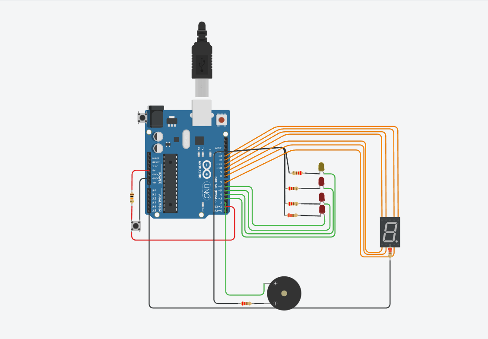

# DOJO 2
--------------------------------------------------------------
# Proyecto: Estacion de subte

### Integrante:
* Josue Damacio

## Descripción
#### Este es un sistema que permite al usuario saber a qué estación de subte está llegando, aparte  el sistema muestra las estaciones que faltan hasta llegar a destino. Ademas el buzzer emite un sonido diferente cada vez que se llegue a una estación.
--------------------------------------------------------------

## Función principal
Defino un nombre descriptivo segun el pin que corresponde del display 7 segmento, tambien se hace lo mismo con las 4 estaciones, el buzzer y el boton.

 Luego en el "void setup()" al display 7 segmentos y a los 4 leds le agrego la funcion "pinMode(nombre,OUTPUT") para que sean configurados como salidas digitales. Por otro lado el boton tiene la funcion "pinMode(nombre,INPUT)" para que funcione como entrada digital y por ultimo está el "Serial.begin()" que hace que la informacion sea visible en el monitor serial
~~~
//7 SEGMENTOS
#define arriba 12 //A
#define	arriba_derecha 13 //B
#define abajo_derecha 7 //C
#define abajo 8 //D
#define abajo_izquierda 9 //E
#define arriba_izquierda 11 //F
#define centro 10 //G
//ESTACIONES
#define primera 6
#define segunda 5
#define tercera 4
#define ultima 3
#define buzzer 2
#define boton 1
int bandera = LOW;
int i = 4;

void setup()
{
  pinMode(arriba_derecha, OUTPUT);
  pinMode(arriba, OUTPUT);
  pinMode(arriba_izquierda, OUTPUT);
  pinMode(centro, OUTPUT);
  pinMode(abajo_izquierda, OUTPUT);
  pinMode(abajo, OUTPUT);
  pinMode(abajo_derecha, OUTPUT);
  pinMode(primera, OUTPUT);
  pinMode(segunda, OUTPUT);
  pinMode(tercera, OUTPUT);
  pinMode(ultima, OUTPUT);
  pinMode(boton,INPUT);
  Serial.begin(9600);
}
~~~
  Por ultimo, defino a la bandera como **"LOW"** que será utilizada para el funcionamiento del botón y tambien **"i"**, que será la varaible de control que junto con el boton harán que **en un loop se le vaya descontando 1 y en caso de ser igual a 0**, se volverá a ejecutar el bucle:
~~~
void loop()
{
  if(digitalRead(boton)== LOW){
    	bandera = HIGH;
  }
  if(bandera == HIGH){
      i--;
      eleccion_de_numero(i);
      if(i == 0)
        i = 4;
  }
  
}
~~~

--------------------------------------------------------------

La siguiente función es la encargada del "Piezo" o "Buzzer", que toma distintos parametros segun el valor que tenga "i" en el loop, en este caso reutilicé la fucion del semaforo del trabajo anterior y la invoque dentro de cada case de un switch (ejemplo con solo un case):
~~~
void sonido(int tiempo, int potencia, int suena, int espera){
  int contador = 0;
  while (contador != (tiempo / (suena+espera)) ){
  		tone(buzzer, potencia, suena);
  		delay(espera);
  		contador++;
  }
}
void eleccion_de_numero(int i){
    switch (i)
    {
    case 0:
        Prende_numero_cero();
      	prende_led(ultima);
      	sonido(1500,500,500,1000);
      	apaga_led(ultima);
        Apaga_numero_cero();
      	mostrar_string("Constitucion");
        break;
    }
}
~~~

Y por cada case, se ejecutaran 2 funciones que una encendera el led y la otra se encargará de preder el conjunto de leds del 7 segmentos que formen el su respectivo numero, seguido de eso sonará el buzzer, y al final se apagan tanto el 7 segmentos como el led de la estación y finalmente por monitor serial se imprime cual fue.

~~~
void prende_led(int led){  	
  digitalWrite(led, HIGH);
}
void espera(){
  delay(1000);
}
void apaga_led(int led){
  digitalWrite(led, LOW);
}
void mostrar_string(String cadena) {
  Serial.println(cadena);
}
~~~

--------------------------------------------------------------

### Link del proyecto 😎
- [link_tinkercad](https://www.tinkercad.com/things/7clMeTWGXCi)